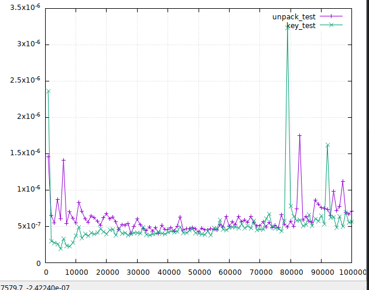

# perf_plot

A Python performance measuring and visualization tool using gnuplot.

## Example Usage:

 

```python
from perf_plot import timeit, perf_test
import sys

sys.dont_write_bytecode = 1  # Include this to prevent pycache

d = dict()


@timeit
def key_test(num: int):
    vals = d.values()


def make_dict(num: int):
    d = {key: key for key in range(num)}


@timeit
def unpack_test(num: int):
    vals = [*d]


perf_test(
    [
        unpack_test,
        key_test,
    ],
    begin=10**3,
    bound=10**5,
    step=10**3,
    callbacks=[make_dict],
)
```

## Prerequisites

You must have `gnuplot` installed to use this tool.

## API

### `perf_test` function

```python
def perf_test(funcs: list, begin=1, bound=10000, step=100, callbacks=[]):
```

Run a list of functions with a range of inputs, time them, and plot their
performance.

#### _`list`_ **`funcs`**

> A list of tester functions that:
>
> - Each take an int, and
> - Do some comparable operations that scale accordingly
>
> e.g `[labmda x: [i for i in range(x)], lamba y: (i for i in range(y))]`

#### _`int`_ **`begin`**

> The lower bound of the test, defaults to `1`

#### _`int`_ **`bound`**

> The upper bound of the test, defaults to `10000`

#### _`int`_ **`step`**

> How much to increment for each iteration, defaults to `100`

#### _`list`_ **`callbacks`**

> A list of callbacks to run before testing each function, defaults to `[]`

### `@timeit` decorator

```python
@timeit
def example_func(n):  # Replace with a function you want to time
    return n * 2
```

> `@timeit` decorator: Time a function
